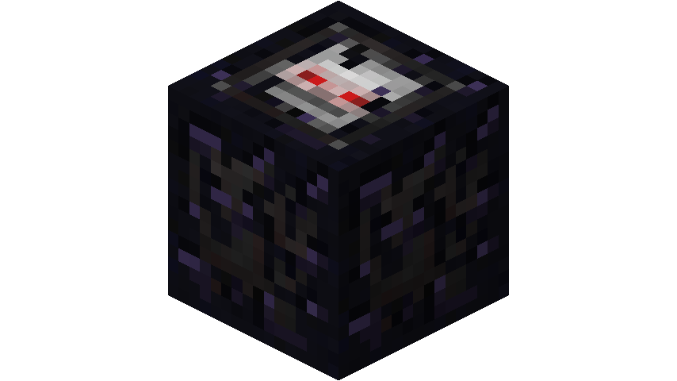

# BTA Tiny ChunkLoader

*Use the ancient power of the motion to create powerful tiny 3x3 chunk loader.*

Work both in ~~Single Player and~~ Multiplayer

*Note: Single Player don't work since it need a complete rework on how chunk are handled, in future I will bring back it when I have more time and interest* However you can still place this cute block in your SP world if you want

*Is also compatible as a turtle version for BTA CC*

Requirements:

- BTA (https://www.betterthanadventure.net)
- Babric for BTA https://github.com/Turnip-Labs/babric-instance-repo/releases/tag/v7.3_03
- HalpLibe (https://github.com/Turnip-Labs/bta-halplibe)
