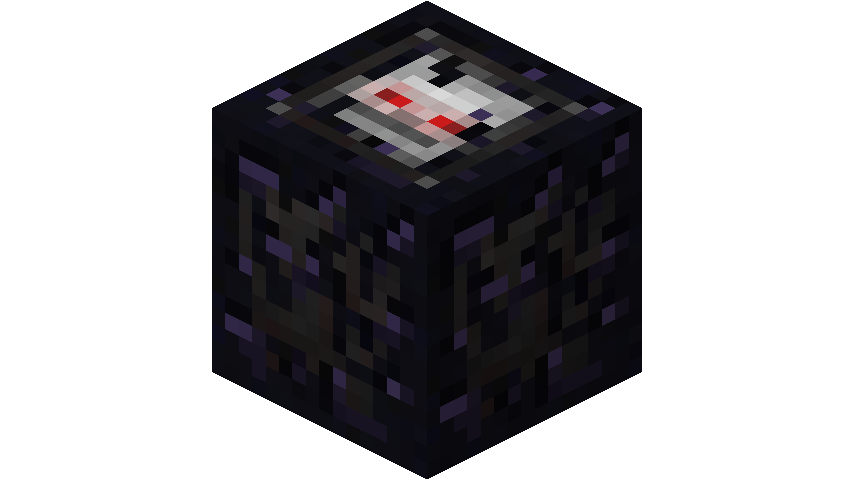

# BTA Tiny ChunkLoader

*Use the ancient power of the motion to create powerful tiny 3x3 chunk loader.*

Work both in Single Player and Multiplayer.

***Fully configurable now !***

*Is also compatible as a turtle version for BTA CC*

Requirements:

- BTA (https://www.betterthanadventure.net)
- Babric for BTA https://github.com/Turnip-Labs/babric-instance-repo/releases/tag/v8.0
- HalpLibe (https://github.com/Turnip-Labs/bta-halplibe)

***Thanks so much to @MartinSVK12 for fixing this mod for Single Player***
